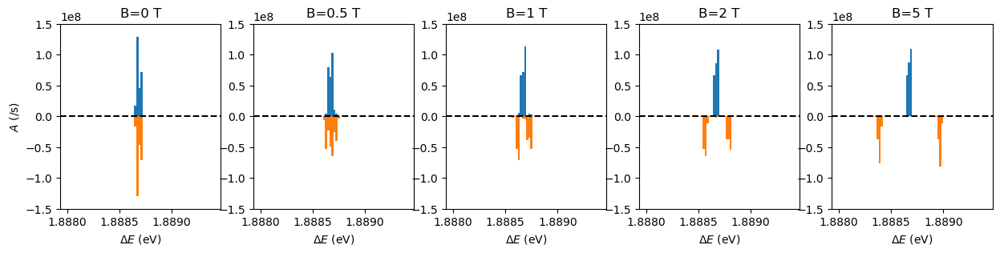

# lineshapes

A small python library to compute line shapes for atomic systems

## Zeeman patterns
This module computes the Zeeman splitting for atomic lines. Currently, only "LS" coupled system is supported.

### Examples

#### Almost pure L-S coupled transitions
```python
>>> energy_upper = [
>>>     12.0874936591, 12.0875071004,  # 3p (1/2, 3/2)
>>>     12.0874949611,                 # 2s (1/2)
>>>     12.0875070783, 12.0875115582,  # 3d (3/2, 5/2)
>>> ]
>>> L_upper = [1, 1, 0, 2, 2]
>>> J_upper = [1/2, 3/2, 1/2, 3/2, 5/2]
>>> S_upper = 1/2
>>> energy_lower = [
>>>     10.19880615024, 10.19885151459,  # 2p (1/2, 3/2)
>>>     10.19881052514816                # 2s (1/2)
>>> ]
>>> L_lower = [1, 1, 0]
>>> J_lower = [1/2, 3/2, 1/2]
>>> S_lower = 1/2
>>> Spq = np.array([
>>>     # from 3p(1/2)   3p(3/2)    3s(1/2)      3d(3/2)    3d(5/2)
>>>     [       0.0,        0.0, 5.8769e-01, 3.0089e+01,        0.0],   # to 2p (1/2)
>>>     [       0.0,        0.0, 1.1756e+00, 6.0180e+00, 5.4162e+01], # to 2p (3/2)
>>>     [6.2687e+00, 1.2537e+01,        0.0,        0.0,        0.0],  # to 2s (1/2)
>>> ]).T
>>> lineshapes.zeeman.LS(
>>>     energy_upper, energy_lower, J_upper=J_upper, J_lower=J_lower, 
>>>     L_upper=L_upper, L_lower=L_lower, S_upper=S_upper, S_lower=S_lower, 
>>>     B=7, # The magnetic field strength in [T]
>>>     line_strengths_LJ=Spq,
>>>     ignore_LS_selectionrules=True,
>>>     return_xr=True  # This enables to return the result by xr.Dataset
>>> )
<xarray.Dataset>
Dimensions:       (deltaM: 3, M: 6, upper: 5, lower: 3, upper0: 5, lower0: 3)
Coordinates:
    deltaE        (deltaM, M, upper, lower) float64 nan nan nan ... nan nan nan
    E_upper       (M, upper) float64 nan nan nan nan 12.09 ... nan nan nan 12.09
    E_lower       (M, lower) float64 nan nan nan nan 10.2 ... nan nan nan nan
  * deltaM        (deltaM) int32 -1 0 1
    L_upper       (upper) int32 1 1 0 2 2
    L_lower       (lower) int32 1 1 0
    mixing_upper  (M, upper, upper0) float64 nan nan 0.0 0.0 ... 0.0 0.0 0.0 1.0
    mixing_lower  (M, lower, lower0) float64 nan nan 0.0 nan ... 0.0 0.0 0.0 nan
    S_upper       (upper) float64 0.5 0.5 0.5 0.5 0.5
    S_lower       (lower) float64 0.5 0.5 0.5
    B             int32 7
  * M             (M) float64 -2.5 -1.5 -0.5 0.5 1.5 2.5
Dimensions without coordinates: upper, lower, upper0, lower0
Data variables:
    strength      (deltaM, M, upper, lower) float64 0.0 0.0 0.0 ... 0.0 0.0 0.0
    A             (deltaM, M, upper, lower) float64 nan nan nan ... nan nan nan
```



#### Transitions that does not follow the selection rules of LS coupling.

The selection rules of LS coupling include
- ΔL = ±1
- ΔS = 0

Sometimes, we may want to calculate the transition which does not follow these rules.
An example of this is the 4p -  4s transition of singly charged Argon.
In this case, we may need to set `ignore_LS_selectionrules=False`

```python
>>> # the energies and quantum numbers of the upper levels
>>> energy_upper = [19.30534490, 19.261084163, 19.222902151]  # 4p 4P
>>> L_upper = 1
>>> J_upper = [1/2, 3/2, 5/2]
>>> S_upper = 3/2
>>> # energies and quantum numbers of the lower levels
>>> energy_lower = [16.81247225, 16.74852891, 16.64385439]  # 4s 4P
>>> L_lower = 1
>>> J_lower = [1/2, 3/2, 5/2]
>>> S_lower = 3/2
>>> # Line strength between the upper and lower states.
>>> Spq = np.array([
>>>     # from 4p(1/2)   4p(3/2)    4p(5/2)
>>>     [ 1.2e+00, 5.72e+00,      0.0],  # to 4s (1/2)
>>>     [9.56e+00, 3.42e+00, 5.63e+00],  # to 4s (3/2)
>>>     [     0.0, 1.22e+01, 2.57e+01],  # to 4s (5/2)
>>> ]).T
>>> 
>>> # Compute the perturbed energy levels and the transition strength among these states
>>> lineshapes.zeeman.LS(
>>>     energy_upper, energy_lower, J_upper=J_upper, J_lower=J_lower, 
>>>     L_upper=L_upper, L_lower=L_lower, S_upper=S_upper, S_lower=S_lower, 
>>>     B=1, # The magnetic field strength in [T]
>>>     line_strengths_LJ=Spq,
>>>     ignore_LS_selectionrules=True,
>>>     return_xr=True  # This enables to return the result by xr.Dataset
>>> )
<xarray.Dataset>
Dimensions:       (deltaM: 3, M: 6, upper: 3, lower: 3, upper0: 3, lower0: 3)
Coordinates:
    deltaE        (deltaM, M, upper, lower) float64 nan nan nan ... nan nan nan
    E_upper       (M, upper) float64 nan nan 19.22 nan ... 19.26 nan nan 19.22
    E_lower       (M, lower) float64 nan nan 16.64 nan ... 16.75 nan nan 16.64
  * deltaM        (deltaM) int32 -1 0 1
    L_upper       (upper) int32 1 1 1
    L_lower       (lower) int32 1 1 1
    mixing_upper  (M, upper, upper0) float64 1.0 0.0 0.0 0.0 ... 0.0 0.0 0.0 1.0
    mixing_lower  (M, lower, lower0) float64 1.0 0.0 0.0 0.0 ... 0.0 0.0 0.0 1.0
    S_upper       (upper) float64 1.5 1.5 1.5
    S_lower       (lower) float64 1.5 1.5 1.5
    B             int32 1
  * M             (M) float64 -2.5 -1.5 -0.5 0.5 1.5 2.5
Dimensions without coordinates: upper, lower, upper0, lower0
Data variables:
    strength      (deltaM, M, upper, lower) float64 0.0 0.0 0.0 ... 0.0 0.0 0.0
    A             (deltaM, M, upper, lower) float64 nan nan nan ... nan nan nan
```

## License

Copyright 2018, lineshapes Developers

Licensed under the Apache License, Version 2.0 (the "License");
you may not use this file except in compliance with the License.
You may obtain a copy of the License at

  http://www.apache.org/licenses/LICENSE-2.0

Unless required by applicable law or agreed to in writing, software
distributed under the License is distributed on an "AS IS" BASIS,
WITHOUT WARRANTIES OR CONDITIONS OF ANY KIND, either express or implied.
See the License for the specific language governing permissions and
limitations under the License.
